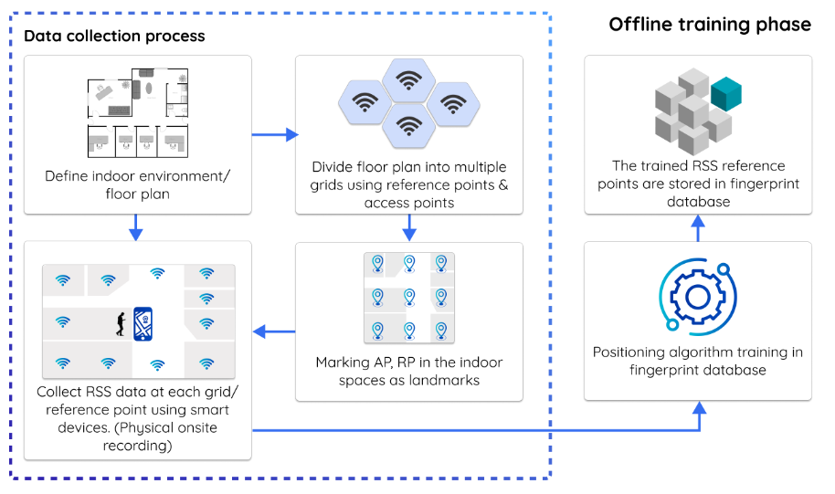
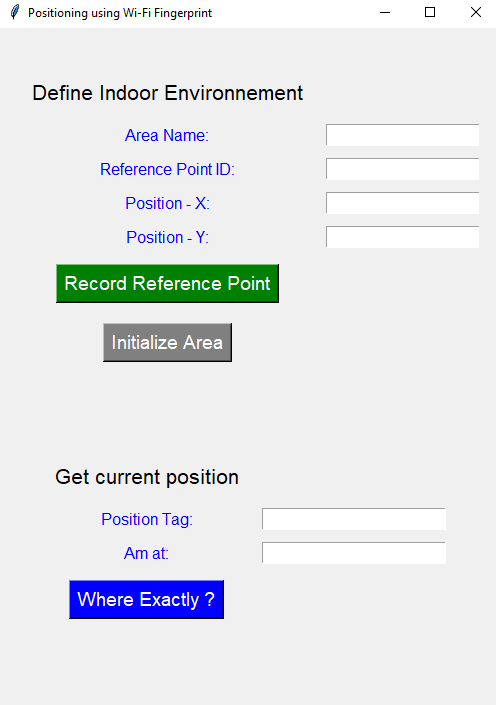

# Indoor Positioning App (README)

## Overview

The Indoor Positioning App is designed to help you define indoor environments, record reference points (RPs), and determine your current position within a predefined area. The app leverages Wi-Fi fingerprinting and provides a user-friendly interface to interact with these features.

## Features

### 1. Define Indoor Environments
- Use the name of the area as a label.
- Record multiple reference points within an area, including location and Wi-Fi fingerprint data.
- Update reference points within a specific area.
- Initialize a new area from scratch by recording new reference points.

### 2. Get Your Current Position (After Defining the Environment)
- Enter the name of the area you are currently in using the "Am at" text field.
- Provide a "Position Tag" to identify your exact current position.
- Click the "Where am I" button to get your current position within the defined area.

## Admin Features

- Admin access is available for system management.
- View available environments (areas) and the recorded reference points within them.
- Delete areas and their associated data.

## Usage

1. **User Mode**: If you are using the application as a regular user, you can access all features through the graphical interface.

2. **Admin Mode**: If you have admin access, you can perform additional actions such as viewing and managing the database. Admin access requires a login and password.

## Screenshots

### Fingerprint Technique

*This image illustrates the concept of fingerprint-based indoor localization.*

### Application GUI

*This screenshot shows the graphical user interface of the application.*

---

**Note:** This README provides an overview of the application's features. For detailed instructions, please refer to the user guide within the application.

For admin access, use the provided login and password to access the admin section.

Enjoy using the Fingerprint-Based Indoor Localization Application!

## Standalone Executable

This application has been bundled as a standalone executable (.exe) file using PyInstaller. To run the executable:

1. Locate the `Fingerprint_Localisation.exe` file in the "distination" directory.

2. Double-click `Fingerprint_Localisation.exe` to launch the application.

## Installation

The standalone executable does not require Python or any additional installations. It runs as a self-contained application.

## Instructions

1. **Defining an Environment**:
   - Fill in the "Area Name," "Reference Point ID," "Position - X," and "Position - Y" fields.
   - Click the "Record Reference Point" button to save the reference point.
   - You can also reinitialize an area using the "Initialize Area" button.

2. **Getting Your Current Position**:
   - Enter the name of the area you are in using the "Am at" field.
   - Provide a "Position Tag" to identify your current position.
   - Click the "Where Exactly?" button to determine your exact location.

3. **Admin Mode**:
   - To access the admin section, enter the correct login and password (if you have admin privileges).
   - In the admin section, you can view and delete areas and their associated data.

## Dependencies

This application relies on the following Python packages:

- tkinter: for the graphical user interface.
- sqlite3: for managing the local database.
- Other custom modules (imported as "Modules as md") that handle database operations and Wi-Fi fingerprinting.

## Acknowledgments

This app was developed by chiheb eddine hmida as a project for the indoor positioning systems course. 

